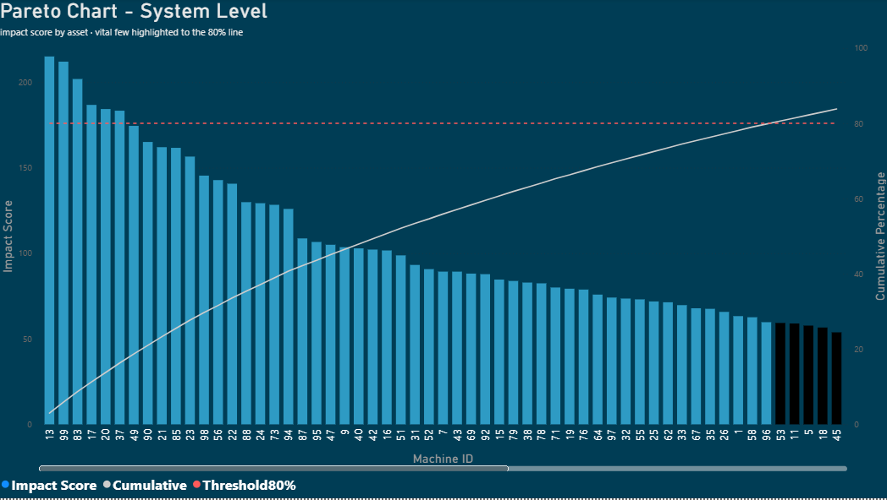
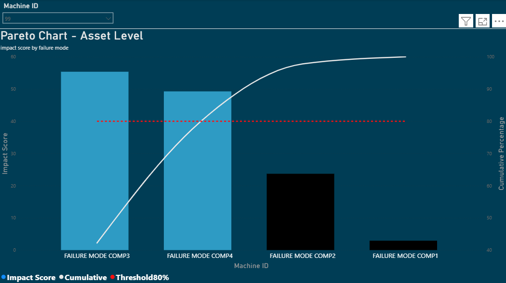
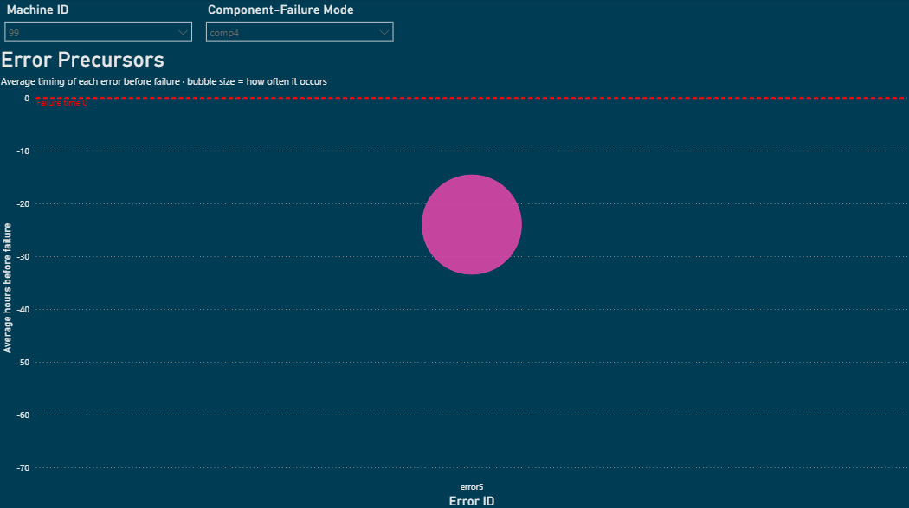
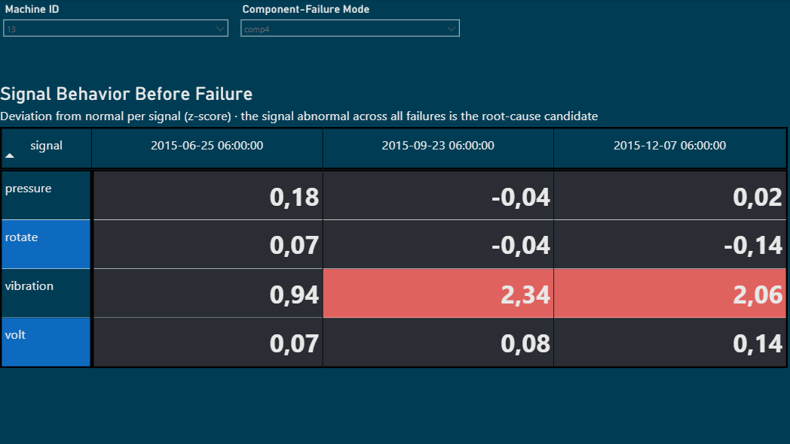
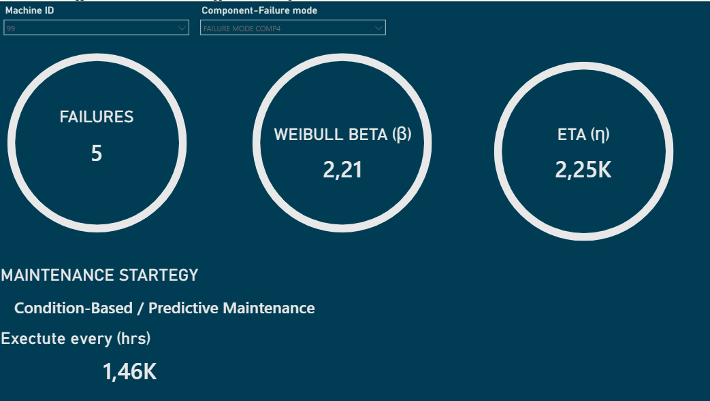

From Failure Data to Decisions: A Data-Driven, Agent-Ready RCM Workflow
> Reliability work often means knowing *something* is wrong long before you can prove *what*. This is a framework I developed during my work to close that gap — to let the data point to the failure mode, the cause, and the right maintenance strategy. I've rebuilt it here on illustrative data to share how it works.
The framework is automated in Python and Power BI: Python handles the data processing and analysis — scoring, failure-mode characterization, and the event and signal analysis — while Power BI delivers it as a connected, interactive report. It's built entirely around Reliability-Centered Maintenance (RCM) principles, with every analysis happening at the failure-mode level.
It's also architected to be integrated into an agentic workflow: the modular, step-by-step structure means the same logic a reliability engineer follows manually could be driven by an AI agent, extending the analysis into areas humans rarely have time to fully cover. The current build implements the analytical workflow itself; the agentic layer described below is what the architecture is designed to support as a next step.
Here's how it works, screen by screen — and where an agent would extend each step.
---
1. Prioritize the assets, continuously 
 
The starting point is a Pareto, but not the usual "count the failures" version. Counting failures rewards the machine that breaks often and cheaply over the one that breaks rarely and catastrophically. Instead, each asset is scored on what actually matters: 

Recurrence — chronic, repeating problems weigh more than one-offs 
Recency — recent failures matter more than old ones 
Sensitivity — how critical that asset is to the process, based on availability model 

Because recency is built in, the ranking updates itself. Fix a problem and the asset fades from the list; if it stays near the top, the fix didn't hold. The priority list doubles as a validation tool.
Where an agent fits: this ranking could be monitored continuously rather than at review meetings, flagging the moment a failure mode climbs into the vital few — and beginning the analysis below before a human opens the report.
---
2. Drill into the failure mode

Pick the top asset, and the same logic repeats one level down: which failure mode drives its score. RCM places analysis at the failure-mode level, and this is where it begins.
Where an agent fits: the highest-contributing failure mode could be selected automatically and carried forward as the subject of the investigation.
---
3. Read the evidence — events and signals

For the selected failure mode, two complementary data sources are examined, both aligned to the moment of failure.
The error log shows which events fire before the failure and when, revealing whether a consistent precursor pattern exists.

The continuous sensor data shows which signals left their normal range, how strongly, and how early. When one signal lights up across every failure while the rest stay quiet, that consistency is the signature of a root cause. Abnormal in one failure is noise; abnormal in all of them is a mechanism.
Where an agent fits: both views could be read and quantified automatically — assembling the evidence picture across many failure modes in parallel, which is impractical to do by hand at scale.
---
4. Reading the unstructured evidence — the natural next layer
This is where an agent would add something genuinely new.
Beyond the numbers, every failure carries context locked in text: the work order descriptions the technician wrote, the equipment manuals specifying correct procedures and service intervals, the maintenance history of what was last done. A reliability engineer rarely has time to read all of it across hundreds of failures. An LLM-based agent could.
By reading work order text against the manual and the maintenance record, an agent could surface causes the sensor data alone never reveals — for example, recognizing that a recurring failure mode follows a pattern of incorrect or deferred maintenance rather than a genuine component weakness. A bearing that keeps failing may not have a design problem; it may have a lubrication step that isn't being followed. That distinction completely changes the right response — and it lives in the text, not the telemetry.
This is the difference between "this component fails every 3 weeks" and "this component fails every 3 weeks because the documented service step is being skipped." Only the second tells you what to actually fix. This layer isn't part of the current build — the dataset used here has no manuals or work order text — but the workflow is structured to accept it directly.
---
5. Characterize and decide

The failure mode is characterized with Weibull analysis — the shape factor (β) indicating whether failures are random, infant-mortality, or wear-out — and a maintenance strategy follows from the evidence:
Strong, consistent indicators → predictive maintenance on those precursors
Strong wear-out behavior → scheduled replacement at the right point in component life
Maintenance-induced pattern (from the text) → fix the procedure or compliance, not the component
Weak or inconclusive data → condition-based inspection, until enough data reveals a pattern
Random, low-consequence → run to failure
The honest part matters most: when the data doesn't support prediction, the workflow says so and falls back to inspection rather than faking confidence.
Where an agent fits: the agent could propose the strategy the combined evidence supports, with its reasoning attached, then escalate to a human engineer for the decisions that need judgment. It recommends; the engineer decides.
---
The loop
After acting, the impact score keeps tracking the failure mode. An effective action shows up as a declining score; an ineffective one keeps it visible. That closes the RCM loop — detect → analyze → act → verify — continuously.
Driven by an agent, this loop could run on its own: watching the priority ranking, investigating new entries as they appear, reading both the quantitative signals and the written record, proposing a strategy, and after an intervention checking whether the score actually fell. A periodic manual analysis becomes an always-on reliability layer.
---
Why the architecture supports this
The agentic potential isn't an afterthought — it follows from how the workflow is built. Each stage (prioritization, event analysis, signal analysis, characterization, and a future text-analysis step) is self-contained, with structured inputs and outputs. That modularity means an agent could drive the chain end to end, call each step like a tool, and combine the numerical evidence with what it reads in work orders and manuals — escalating to a human exactly where judgment is required.
---
Notes
This is a template, not a fixed recipe — it's adapted to each system. In some plants, chronic recurring failures and large one-off failures deserve separate analysis paths. The structure stays; the engineer tailors the branches. The method prioritizes and informs — it doesn't replace engineering judgment.
Built with Python and Power BI, and architected for integration into an agentic workflow. The dataset used here is illustrative and contains no proprietary information.
---
Tech stack: Python (data processing, scoring, Weibull analysis, event & signal analysis) · Power BI (interactive reporting) · designed for agentic orchestration.
